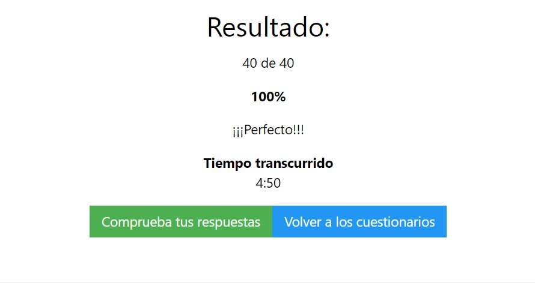

<b>1. Quiz HTML</b> 
             Quiz en la página de w3school el cual consistia en poner a prueba nuestros conocimientos básicos acerca de HTML. 
             

<b>2. Quiz CSS</b> 
              Quiz en la página de w3school el cual consistia en poner a prueba nuestros conocimientos básicos acerca de CSS.
              

<b>3. Quiz JS</b> 
              Quiz en la página de w3school el cual consistia en poner a prueba nuestros conocimientos básicos acerca de JS.
              