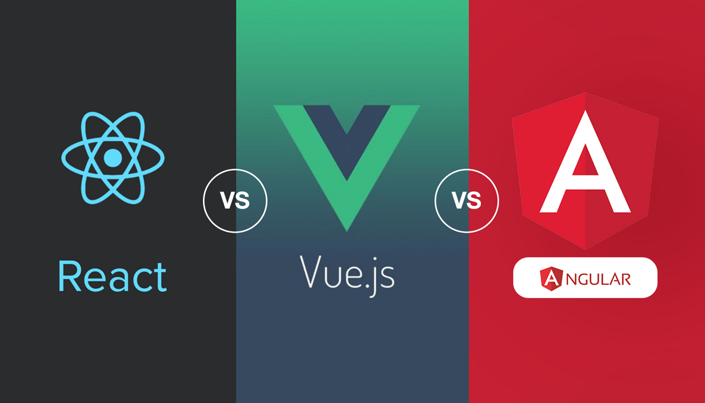

<button onclick="window.location.href='https://reactprojectelmaximi.netlify.com/'" target="_blank" class="button button2">React JS</button>
<button onclick="window.location.href='https://elmaximi.com/vue/'" target="_blank" class="button button3">Vue JS</button>
<button onclick="window.location.href='https://pruebanagular1.netlify.com/'" target="_blank" class="button button1">Angular JS</button>

