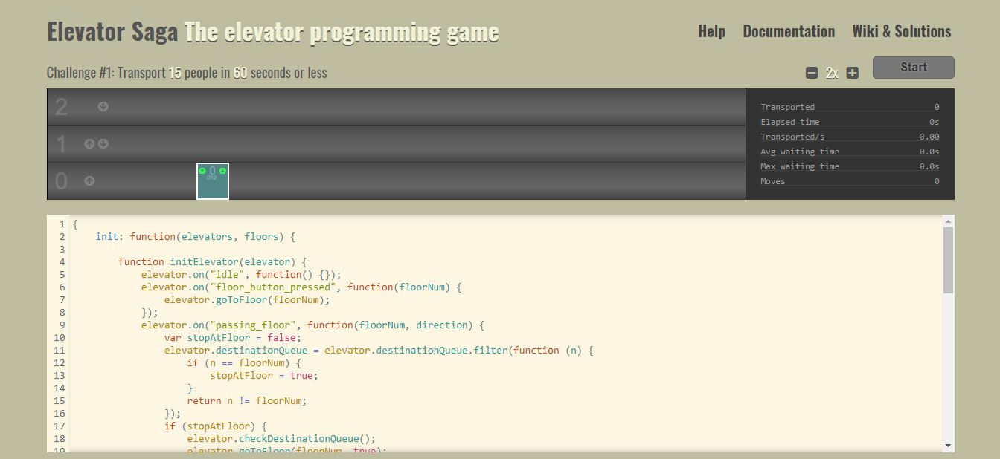

Es un juego que consiste en programar, usando Javascript y una API que te ofrecen, un ascensor que vaya recogiendo y soltando gente en diferentes plantas e ir superando los distintos retos y niveles.
Es un juego donde se puede practicar un poco la logica de programacion para resolver algunos problemas, en este caso solo resolvimos hasta el nivel 10.

Puedes revisar la solución de los 10 primeros niveles<a href="https://elmaximi.com/blog/blog-single8" target="_blank"> aquí.</a>

El link del juego es el siguiente: <a href="https://play.elevatorsaga.com/ "  target="_blank">https://play.elevatorsaga.com/ </a>

