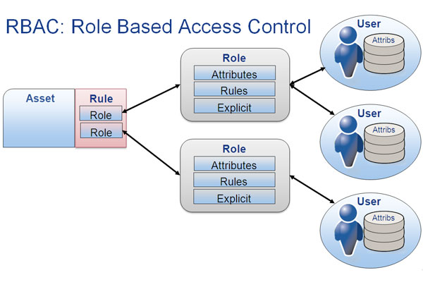

 

El control de acceso basado en roles (RBAC) restringe el acceso a la red según el rol de una persona dentro de una organización y se ha convertido en uno de los métodos principales para el control de acceso avanzado. Los roles en RBAC se refieren a los niveles de acceso que los empleados tienen a la red.
<d>

A través de RBAC, puede controlar lo que pueden hacer los usuarios finales tanto a nivel amplio como granular. Puede designar si el usuario es un administrador, un usuario especialista o un usuario final, y alinear los roles y permisos de acceso con las posiciones de sus empleados en la organización. Los permisos se asignan solo con suficiente acceso según sea necesario para que los empleados puedan realizar su trabajo.
